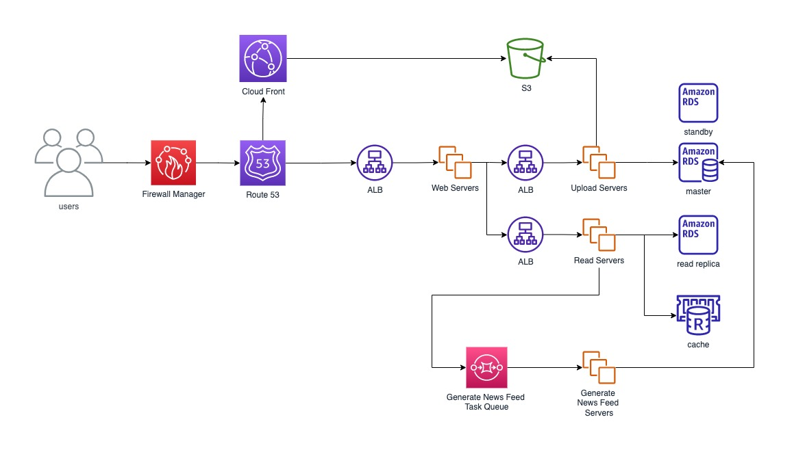

# Designing Instagram

## Requirements and Goals

- Users can upload/download/view photos and videos.
- Users can search with the titles of photos and videos.
- Users can follow other users.
- Users can get feeds from the people they follow.

## Component Design



Servers are wrapped by auto scaling groups for better reliability.

Servers and databases are put in private subnets for better security.

Chained by security group chain for better security:

```
Web Security Group --> Upload Security Group -> DB Security Group
                   |-> Write Security Group
```

### Storage

- Set lifecycle policy to store the put static resources into different Amazon S3 storage types.
- Use AWS Lamda to resize uploaded images.
- Set backup replica in a different region to prevent file missing.

### Database

- Create standby DB instances and read replicas.

### Backup and Recovery Strategy

- Use AWS backup.
- I would choose `Pilot light` as our recovery strategy.

  When disaster strikes, the servers in the recovery environment start up and then Route 53 begins sending production traffic to the recovery environment.

## Ranking and News Feed Generation

Pre-generating the News Feed and storing them in another table regularly with dedicated servers. Whenever a user requests the News Feed, we can simply return the results to the user. Then, re-generate the News Feed from that time.

### Send News Feed to the users

**Approach 1: Pull**

Clients pull the News Feed at a regular interval or manually.

Problems:

1. New data might not be shown to the users until clients issue a pull request
2. Most of the time, pull requests will result in an empty response if there is no new data.

**Approach 2: Push**

Servers push the News Feed to the users as soon as it is available.

Requirements:

1. Clients have to maintain a long pull request with the server.

Problems:

1. Servers have to push updates quite frequently for those users who follow a lot of people.

**Approach 3: Hybrid**

Choose pull-based model for the uses who follow a lot of people. And choose push-based model for the regular users.
