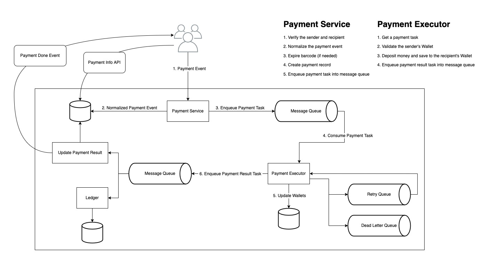

# Designing QR Code Payment

## Requirements and Goals

- Users can send money to another account.
- Users can pay something by scanning the static QR code provided by merchants.
- Users can pay something by letting merchants scan their dynamic barcode.

## APIs

- `POST /payments/send`
- `POST /payments/withdraw`
- `POST /payments/pay`
- `GET /payments/{:payment_id}`

## Component Design

### Payment Service

1. Verify the sender and recipient
2. Normalize the payment event
3. Expire barcode (if needed)
4. Create payment record
5. Enqueue payment task into message queue

### Payment Executor

1. Get a payment task
2. Validate the sender's Wallet
3. Deposit money and save to the recipient's Wallet
4. Enqueue payment result task into message queue

### Message Queue

Handle streaming data.

### Retry Queue

The failed payment task will be enqueued into retry queue to retry this payment task.

### Dead Letter Queue

If one payment task can’t be processed, it will be enqueued into the dead letter queue. So the engineer team can inspect this message later to find the issue.

### Ledger

The ledger keeps a financial record of the payment transaction. For example, when a user pays the seller $1, we record it as debit $1 from a user and credit $1 to the seller. The ledger system is very important in post-payment analysis. In our case, It will be used in the reconciliation.

### Update Payment Result

1. Update the payment’s status.
2. Send Payment Done Event to sender and recipient.

## Design Deep Dive

### Generate the dynamic barcode

We can pre-generate the barcodes then store them in `Redis`.
So, users can retrieve a new barcode as soon as they want.

### Expire the dynamic barcode

To prevent user’s `barcode` is captured by some bad guy.

We can expire the `barcode`:

- after a certain interval after the `barcode` is fetched
- if the `barcode` is used

### Reconciliation

When system components communicate asynchronously, there is no guarantee that a message will be delivered, or a response will be returned. This is very common in the payment business, which often uses asynchronous communication to increase system performance.

So we can use reconciliation to compares the states among related services periodically to verify that the system is internally consistent.

For example, the ledger and wallet might diverge and we could use the reconciliation system to detect any discrepancy.

### Communication among internal services

We can choose `Kafka` as our message queue because it can handle high-throughput and it can have multiple receivers.

### Handling failed payments

Use retry queue and dead letter queue.

### Exact-once delivery

We must not to send or withdraw or pay the money more than once.

And mathematically, an operation is executed exactly-once if:

1. It is executed at-least-once.
   1. Retry the payment if failed.
2. At the same time, it is executed at-most-once.
   1. use `Idempotency` to ensure the at-most-once guarantee.

### Development

- Develop in production.
  Send the `/GET` requests from a local dev machine to the production server. Then we can get the production data.
- Route production traffic to dev servers
  We can find some stores. Give them a special deal if they are willing to be our pilot stores. Then we can route the production traffic of those stores to the dev servers. Mostly, to the release candidate environment or canary environment.

### Monitor

- We can use CloudWatch, CloudTrail and ElasticSearch to do monitoring and logging

### Reliability

If we are using AWS. We should do multi-AZ deployment.

And for disaster recovery, I would choose the recovery strategy called `multi-site active/active`.

Both Production A and Production B environments run web servers, app servers, and databases to handle production traffic. Route 53 routes traffic between the two environments.

### Security

- Use the security group chaining
- Only put `NAT-Gatways` in the public subnets, other components should be placed inside private subnets.

### Performance

We could setup the CDN like CloudFront to server the cached static resources.

And for any image stores in our bucket like S3, we could use `Lamda` to automatically resize the image. So we can deliver the image with multiple size based on the user’s device viewport.

To handle traffic spike, we can aggressively scale out. And we can also leverage some spot instance to lower our cost.
